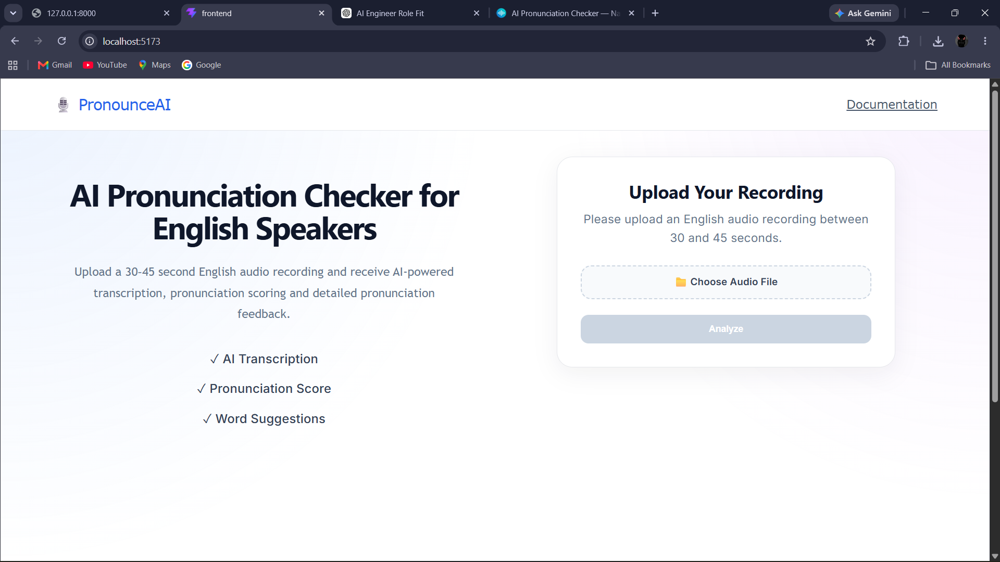
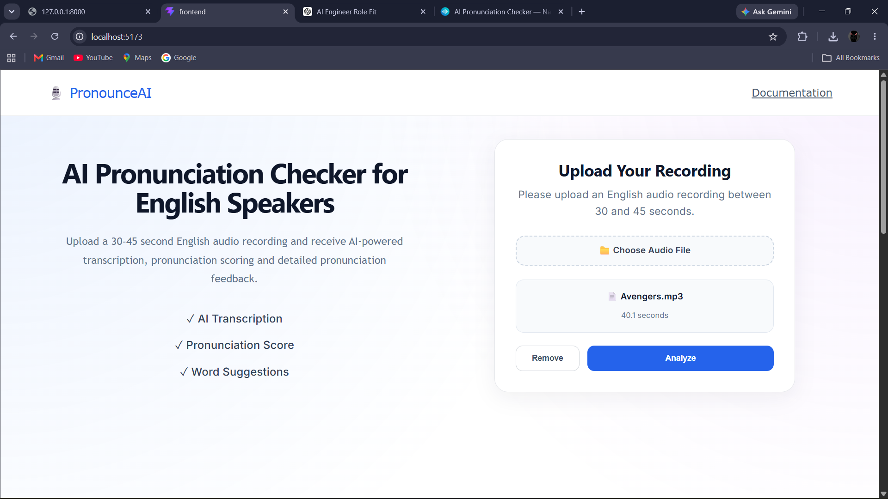
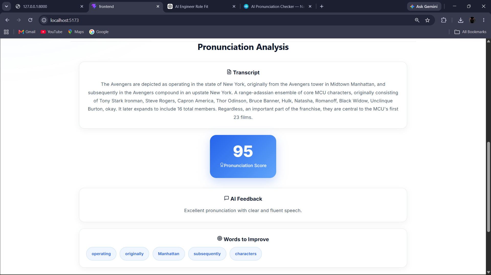

# 🎙️ PronounceAI

An AI-powered English Pronunciation Analyzer built using **React**, **FastAPI**, and **faster-whisper**.

PronounceAI allows users to upload a 30–45 second English audio recording and receive:
- Automatic speech transcription
- Pronunciation score
- AI-generated pronunciation feedback
- Suggested words for improvement

---

## 📸 Screenshots

### Landing Page



---

### Upload Audio



---

### Pronunciation Analysis



---

# ✨ Features

- 🎤 Upload English audio recordings (30–45 seconds)
- 📝 AI-powered speech transcription using faster-whisper
- 📊 Pronunciation scoring system
- 💬 Personalized pronunciation feedback
- 🎯 Suggested words for improvement
- 🚫 Silent audio detection
- ⚡ Optimized speech processing pipeline
- 📱 Clean and responsive user interface

---

# 🛠 Tech Stack

## Frontend

- React
- Vite
- CSS3

## Backend

- FastAPI
- Python
- faster-whisper
- CTranslate2
- FFmpeg

## AI Pipeline

- Speech-to-text transcription using faster-whisper
- Transcript-based pronunciation analysis
- Automated feedback generation

---

# 📂 Project Structure

```
Pronounce-AI
│
├── Backend
│   ├── services
│   │   ├── analysis_service.py
│   │   └── speech_service.py
│   │
│   ├── main.py
│   ├── requirements.txt
│   └── .gitignore
│
├── frontend
│   ├── src
│   │   ├── components
│   │   │   ├── UploadCard.jsx
│   │   │   ├── AnalysisCard.jsx
│   │   │   └── AnalysisCard.css
│   │   │
│   │   ├── App.jsx
│   │   └── App.css
│   │
│   ├── package.json
│   └── ...
│
└── README.md
```

---

# 🚀 Getting Started

## 1. Clone the repository

```bash
git clone https://github.com/Yugandhar-code/Pronounce-AI.git
```

```
cd Pronounce-AI
```

---

# Backend Setup

Navigate to backend:

```bash
cd Backend
```

Create a virtual environment:

```bash
python -m venv venv
```

Activate environment:

### Windows

```bash
venv\Scripts\activate
```

Install dependencies:

```bash
pip install -r requirements.txt
```

Run FastAPI server:

```bash
uvicorn main:app --reload
```

Backend runs on:

```
http://127.0.0.1:8000
```

---

# Frontend Setup

Navigate to frontend:

```bash
cd frontend
```

Install dependencies:

```bash
npm install
```

Run development server:

```bash
npm run dev
```

Frontend runs on:

```
http://localhost:5173
```

---

# 🔄 How It Works

1. User uploads an English audio recording.
2. React frontend sends the audio file to the FastAPI backend.
3. Backend processes the audio using faster-whisper.
4. Speech is converted into text.
5. Transcript is analyzed for pronunciation patterns.
6. A pronunciation score and improvement suggestions are generated.
7. Results are displayed in the frontend.

---

# ⚡ Performance Optimization

The speech processing pipeline was optimized using:

- faster-whisper instead of standard Whisper inference
- INT8 quantized model execution
- CPU optimized inference configuration
- Voice Activity Detection (VAD) filtering

These optimizations reduce transcription latency while maintaining accurate speech recognition.

---

# 🚀 Deployment

The application is deployed with:

- React frontend hosting
- FastAPI backend deployment
- Production AI inference pipeline

Live Demo:

```
https://pronounce-ai-nine.vercel.app/
```

---

# ⚠️ Current Limitations

- Pronunciation scoring is currently based on transcript-level analysis.
- Supports English audio only.
- Advanced phoneme-level pronunciation comparison is not implemented yet.
- GPU acceleration is not currently enabled.

---

# 🔮 Future Improvements

- Real phoneme-level pronunciation assessment
- Audio waveform visualization
- Audio playback support
- Speech confidence visualization
- User authentication
- Analysis history dashboard
- Advanced AI pronunciation coaching
- GPU-based inference optimization

---

# 👨‍💻 Author

**Yugandhar**

GitHub:

https://github.com/Yugandhar-code

